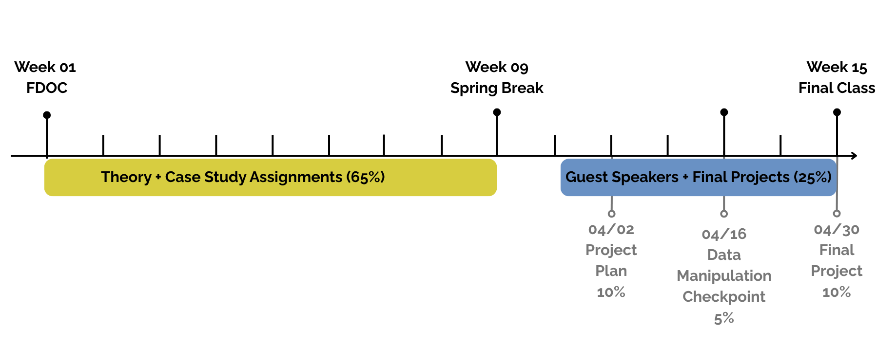

##  Class Overview 
- Centering activity
- Mid-semester Logistics
- Intro to Logic Models
- Group Discussion + Debrief

## Centering Activity
- Show us your cellphone wallpaper! Is there a story behind it? 

## Arc of Semester {.smaller}
- Week 10: Logic Models + Flex Lecture
- Week 11: Guest Lecture + Peer feedback (project proposal due)
- Week 12: Guest lecture Monday (no class thurs)
- Week 13: Guest Lecture + in class work time (data manipulation checkpoint due)
- Week 14: R in class work time (no class Mon)
- Week 15: M in class work time (R Presentations)

## Overview of Class Schedule {.smaller}

## Looking Ahead
- **Next 3 Mondays**
  - 3 speakers across energy, water, and climate
  - Representing advocacy and community organizing, academia, and journalism. 
  - Mix of education/disciplinary backgrounds
  - Sign-up list for speaker engagement: Opportunity for class participation
- **Thursdays:** 
  - In-class time to work on final projects

## Website Resources for Final Project
- [Data sources](https://mariahdaniellecaballero.github.io/ES-202/final_project/data_sources.html)
- [Project descriptions](https://mariahdaniellecaballero.github.io/ES-202/final_project/-desc.html)

## What We Read
- **Friday:** Kellogg, W. K. (2004). [Chapters One and Two](https://drive.google.com/drive/folders/1F_2-X_JVeQLgaMxbjR0bdntatLOK9uxE) in Logic Model Development Guide. Kellogg Foundation.
- **Friday:** Kreger, M., Sargent, K., Arons, A., Standish, M., & Brindis, C. D. (2011). [Creating an environmental justice framework for policy change in childhood asthma: a grassroots to treetops approach](https://drive.google.com/drive/folders/1F_2-X_JVeQLgaMxbjR0bdntatLOK9uxE). American journal of public health, 101(S1), S208-S216.

## Why a Logic Model?
- It's often easy to define what you *want to do*, but it's less easy to define *how you'll get there*, and how you'll *evaluate success*.
- Logic models are useful for communicating a plan for the change you want to see, how you'll measure impact, and the factors at play. 
- Program evaluation is a really cool and important job for community impact and change!

## Basic Logic Model {.smaller}
- Plan backwards, take inspiration from others, and learn along the way! 

## Logic Model Discussion
- What is the value of program evaluation in EJ organizing and policy change? 
- Why is meaasuring impact important? What's challenging about measuring impact for local interventions? 
- Can you see the logic model as a useful tool for new organizations? 

## Childhood Asthma in California 
- Local, regional and state-level initiative to integrate EJ into childhood asthma prevention
- Coalition building at the forefront of planning 
- Flexibility in program implementation and evaluation along the way
- Really impressive policy outcomes! 

## CAFA Logic Model 
-

## CAFA Strategies and Outcomes
- What are the strengths and challenges of CAFA's approach? 
- Thoughts on their "Grasstops" to "Treetops" approach? 
- What role does data play in CAFA's EJ advocacy and policy approaches? 

## As a team
- Can we design a logic model for a campus intervention together? 
  - This could be... food waste, mental health, transportation, affordability, etc. 

## Exit Ticket
- Mid-semester check-in; tell me…
  -  How the class is feeling, and if there’s anything you’d like me to know
  - Flex lecture ideas– any remaining skills you’d like to learn/practice? This could be… redlining data, making more plots, tidying data, etc. 