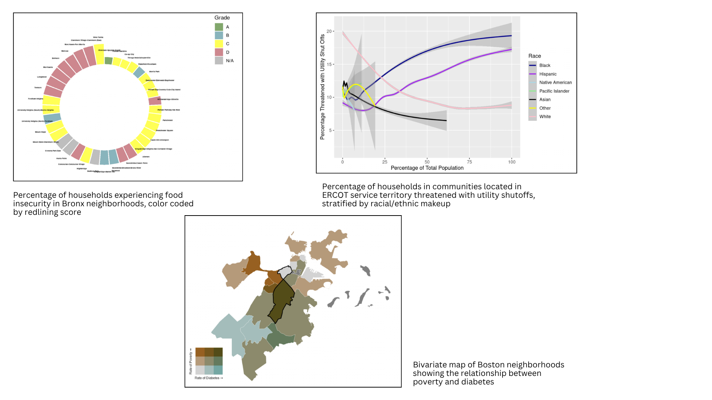

## Happy Thursday! 
- Centering 
- Overview of Final Project 
- Previous Examples 
- Work time to discuss data options

## Centering 
- Ana :-) 

## Overview of Final Project 
  - Three cumulative components: 
    - Project Plan (10%): Due Thursday, April 02 
    - Data Manipulation Checkpoint (5%): Due Thursday, April 16
    - Final Project (10%): Presentations on Thursday, April 30 during class, report due Monday, May 04, 2026 at 11:59 PM 

## Project Plan
- Meant to provide get you started sooner rather than later! Tell me...
  - Background: 
    - EJ theme, community case study, 3 peer-reviewed citations, and EJ tenet(s)
  - Analysis Plan: 
    - Potential data source(s), any manipulation, intended data visuals 
    - Potential intervention and partner organizations for logic model development 
  - Research Process: 
    - Anything you're unsure about/how I can help support!

## Data Manipulation Checkpoint 
  - Meant to ensure you don't leave the data component to the last minute :-) 
    - Part I: Updated research question + reflection: 
      - If your topic/study area has changed, if you still plan to use the same data. 
    - Part II: Data Workflow: 
      - Data importing, tidying, and summarizing 
    - Part III: Progress reflection: 
      - Tell me what's going well, big challenges, and if your analysis plan has changed. 

## Final Project
  - Presentation 
    - 7 minute presentation on project findings (LDOC)
  - Final report
    - ~1500 words
    - Background, theoretical connections, data analysis, and proposed intervention
    - Template and rubric included on website 

## Project Examples (Topics + Theoretical Ties)
- Energy resilience and climate justice in Jobos Bay, PR: Distributional, procedural, and recognition justice
- Food Justice in the Bronx, NY: Distributional, procedural, and recognition justice
- Energy Justice in Texas: Distributional, procedural, and restorative justice
- Environmental health in Boston: Distributional and procedural justice

## Data Visualization Examples 

## Logic Model Example 

## Data Resources   
- Data.gov for a huge selection of data
- ArcGIS Online- spatial data 
- Municipal Data hubs- city-specific data
- Agency data (USEPA, NOAA, etc)

## Data workflow: (example topic: fisheries) {.smaller}
  - If I don't know the specific community I'm interested in: 
    - Start with google images, search "fisheries AND US AND data visualization"
    - Begin getting a sense for ways people are telling stories, and data sources used.
    - Looks like NOAA is collecting a lot of national data on fisheries
    - Website of visualization links to a [national database on fisheries](https://www.fisheries.noaa.gov/foss/f?p=215:200::::::)!
  - Can also start the other way around (i.e., starting with a community that is particularly interesting)
    - Calhoun et al., writes about [policy for fisheries and implications for gender and  household labor](https://www.sciencedirect.com/science/article/abs/pii/S0308597X16301993?via%3Dihub) 
    - Really difficult to find data on gendered dynamics of fisheries, but some google searches led me to 1) fisherman wives groups all over New England (could be a good map); and 2) [NOAA Crew survey data](https://apps-nefsc.fisheries.noaa.gov/crew-survey/main/submit) from commercial fisheries all over the US Eastern Seaboard. 

## Logistics 
- Angie Alberto joining us virtually on Monday! 
  - Two readings on geothermal, Ana to prepare question, Lydia to send thank you email!
