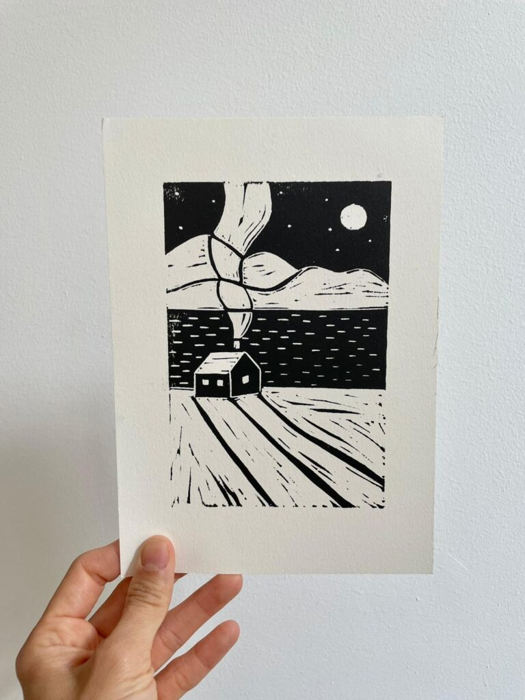
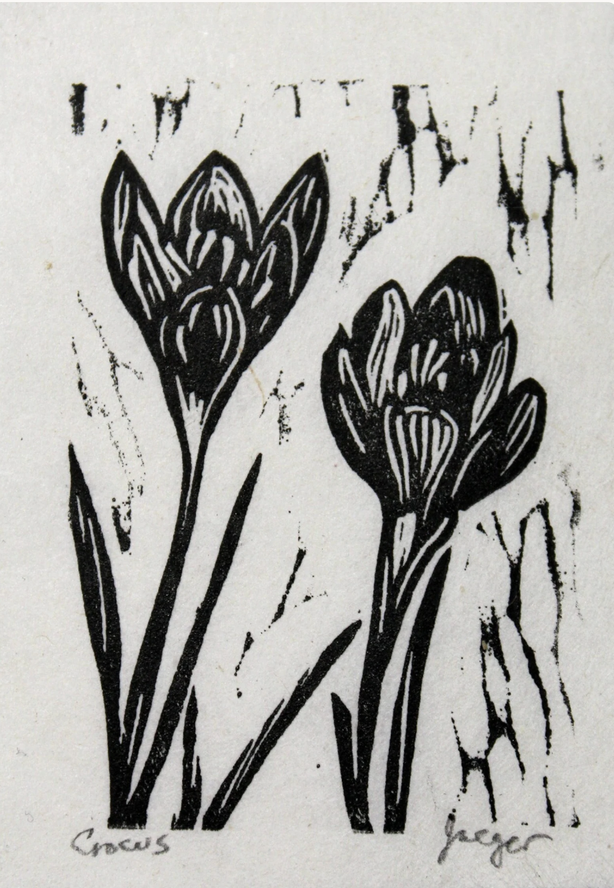

## Happy Thursday! 
- Centering 
- Project work time 
- Logistics 

## Centering 
- Tell me something that's inspired you lately 

## Project Work Time 
- 7 minutes per student to discuss plans with me, answer any last questions
- Project plans due tonight at 11:59 PM 

## Logistics {.smaller}
- Art activity on Monday, with my friend and colleague, Dr. Fernanda Alvarez-Carrascal! 
- One reading, "Existence" in Paper Politics: Socially Engaged Printmaking Today
  - Very short, mostly ✨inspo✨
- To Prep: 
  - Think on one color that represents your environmental heritage
  - Bring a design (simple, mirrored if there's text) for linocutting!

## Example Designs {.smaller}
::: {.columns}
::: {.column}

:::
::: {.column}

:::
:::
<!-- end columns -->